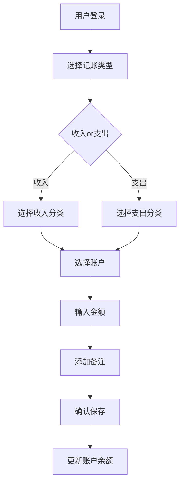
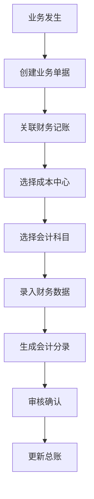

# G-Zang (归藏) 产品需求文档 (PRD)

## 1. 产品概述

### 1.1 产品愿景
G-Zang (归藏) 是一款全场景财务管理系统，致力于通过"平台隔离、业务解耦"的架构，为个人用户提供便捷的日常记账体验，为小微企业提供专业的经营核算服务。

### 1.2 产品定位
- **目标市场**：个人财务管理 + 小微企业财务管理
- **核心价值**：多租户架构，一套系统满足个人和企业需求
- **竞争优势**：微前端架构 + 多端覆盖 + 智能记账

### 1.3 产品目标
- **用户目标**：让记账变得简单、有趣、高效
- **业务目标**：服务100万+用户，覆盖10万+小微企业
- **技术目标**：打造可扩展的SaaS财务管理平台

---

## 2. 用户分析

### 2.1 目标用户群体

#### 2.1.1 个人用户
- **用户画像**：
  - 年龄：25-45岁
  - 职业：白领、自由职业者、学生
  - 收入：中等收入群体
  - 特点：注重生活品质，关注消费分析

- **用户痛点**：
  - 记账繁琐，缺乏持续动力
  - 消费分析不够深入
  - 预算管理困难
  - 多账户管理混乱

- **使用场景**：
  - 日常消费记账
  - 月度消费分析
  - 预算制定和监控
  - 年度财务总结

#### 2.1.2 小微企业用户
- **用户画像**：
  - 企业类型：修理厂、门店、小型工作室
  - 规模：1-20人
  - 特点：业务复杂，财务管理需求迫切

- **用户痛点**：
  - 财务数据分散
  - 成本核算困难
  - 业务与财务脱节
  - 报表生成繁琐

- **使用场景**：
  - 业务流程财务关联
  - 成本中心管理
  - 经营数据分析
  - 税务报表准备

### 2.2 用户旅程地图

#### 个人用户旅程
```
注册 → 首次记账 → 习惯养成 → 数据分析 → 预算管理 → 年度总结
```

#### 企业用户旅程
```
公司注册 → 员工管理 → 业务配置 → 日常记账 → 成本核算 → 经营分析
```

---

## 3. 功能需求

### 3.1 核心功能清单

#### 3.1.1 用户管理功能
- [ ] 用户注册和登录
- [ ] 个人信息管理
- [ ] 密码修改和找回
- [ ] 多设备登录管理

#### 3.1.2 记账核心功能
- [ ] 快速记账（收入/支出）
- [ ] 分类管理（系统预设 + 自定义）
- [ ] 账户管理（多账户支持）
- [ ] 交易记录管理（增删改查）
- [ ] 备注和标签功能

#### 3.1.3 智能记账功能
- [ ] 语音记账
- [ ] 拍照识单（OCR）
- [ ] 智能分类推荐
- [ ] 自动填充功能

#### 3.1.4 数据分析功能
- [ ] 收支统计报表
- [ ] 分类消费分析
- [ ] 趋势分析图表
- [ ] 年度财务报告

#### 3.1.5 预算管理功能
- [ ] 预算制定
- [ ] 预算监控和提醒
- [ ] 预算执行分析
- [ ] 预算调整建议

#### 3.1.6 企业功能
- [ ] 公司管理
- [ ] 员工权限管理
- [ ] 成本中心管理
- [ ] 业务关联记账
- [ ] 经营报表分析

### 3.2 用户故事 (User Stories)

#### 个人用户故事
- **作为**一个上班族，**我想要**快速记录日常消费，**以便**了解我的消费习惯
- **作为**一个预算控制者，**我想要**设置月度预算，**以便**避免超支
- **作为**一个投资爱好者，**我想要**查看财务趋势，**以便**做出更好的投资决策
- **作为**一个记账新手，**我想要**语音记账功能，**以便**降低记账门槛

#### 企业用户故事
- **作为**修理厂老板，**我想要**关联维修单和财务记录，**以便**准确核算成本
- **作为**财务负责人，**我想要**多维度分析经营数据，**以便**优化业务决策
- **作为**企业管理员，**我想要**管理员工权限，**以便**保障数据安全
- **作为**税务筹划者，**我想要**自动生成税务报表，**以便**简化税务申报

---

## 4. 业务流程

### 4.1 个人记账流程


### 4.2 企业记账流程


---

## 5. 非功能需求

### 5.1 性能需求
- **响应时间**：页面加载 < 2秒，API响应 < 500ms
- **并发用户**：支持1000+并发用户
- **数据处理**：每日处理10万+笔交易记录

### 5.2 安全需求
- **数据加密**：敏感数据加密存储
- **访问控制**：基于角色的权限管理
- **审计日志**：完整记录用户操作日志

### 5.3 可用性需求
- **兼容性**：支持主流浏览器和移动设备
- **无障碍性**：符合WCAG 2.1 AA标准
- **国际化**：支持中文简体/繁体

---

## 6. 验收标准

### 6.1 功能验收标准
- [ ] 所有核心功能正常运行
- [ ] 用户故事100%覆盖
- [ ] 业务流程完整实现
- [ ] 异常情况正确处理

### 6.2 性能验收标准
- [ ] 页面加载时间 < 2秒
- [ ] API响应时间 < 500ms
- [ ] 支持1000并发用户
- [ ] 系统可用性 > 99.9%

### 6.3 安全验收标准
- [ ] 通过安全渗透测试
- [ ] 数据加密完整性校验
- [ ] 权限控制无漏洞
- [ ] 日志审计功能正常

---

## 7. 风险评估

### 7.1 技术风险
- **微前端架构复杂性**：可能增加开发和维护成本
- **多租户数据隔离**：数据安全和性能挑战
- **移动端兼容性**：不同设备适配问题

### 7.2 业务风险
- **用户习惯培养**：记账习惯难以养成
- **市场竞争**：财务管理领域竞争激烈
- **合规要求**：财务数据合规性要求高

### 7.3 运营风险
- **用户增长缓慢**：初期用户获取困难
- **数据安全事故**：可能导致用户流失
- **技术债务积累**：长期维护成本增加

---

## 8. 产品路线图

### 8.1 V1.0 (MVP版本)
- ✅ 用户注册登录
- ✅ 基础记账功能
- ✅ 简单数据统计
- ✅ PC端和移动端

### 8.2 V2.0 (完整版本)
- 🔄 企业功能模块
- 🔄 智能记账功能
- 🔄 高级报表分析
- 🔄 预算管理功能

### 8.3 V3.0 (智能版本)
- 📋 AI助手功能
- 📋 自动分类识别
- 📋 财务预测分析
- 📋 税务申报辅助

---

**文档版本**：1.0.0
**最后更新**：2026-01-14
**维护人员**：产品经理团队
