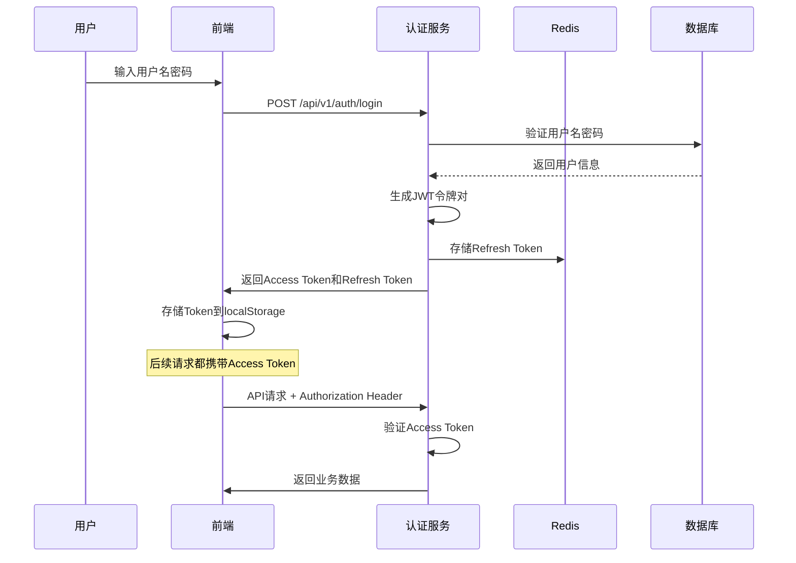

# G-Zang (归藏) 安全设计文档

> **文档版本**：1.0.0
> **最后更新**：2026-03-27
> **维护人员**：安全工程师
> **关联规则**：`security.mdc`、`.cursor/rules/security.mdc`

## 1. 安全概述

### 1.1 安全目标
- **机密性**：确保敏感数据不被未授权访问
- **完整性**：确保数据在传输和存储过程中不被篡改
- **可用性**：确保系统能够持续稳定运行
- **可审计性**：记录所有安全相关操作，便于审计和追踪

### 1.2 安全原则
- **最小权限原则**：用户和系统组件只拥有完成任务所需的最小权限
- **深度防御**：多层安全防护，即使某一层被突破，其他层仍能提供保护
- **安全默认**：系统默认安全，明确授权才允许访问
- **持续监控**：实时监控安全事件和异常行为

---

## 2. 身份认证与授权

### 2.1 JWT身份认证

#### 2.1.1 JWT令牌结构
```javascript
// JWT Header
{
  "alg": "HS256",           // 签名算法
  "typ": "JWT"              // 令牌类型
}

// JWT Payload (包含用户身份信息)
{
  "sub": "1234567890",      // 用户ID
  "username": "john.doe",   // 用户名
  "role": "USER",           // 用户角色
  "companyId": "1001",      // 企业ID (可选)
  "iat": 1516239022,        // 签发时间
  "exp": 1516242622,        // 过期时间
  "iss": "gzang-app"        // 签发者
}

// JWT Signature (使用密钥签名)
HMACSHA256(
  base64UrlEncode(header) + "." + base64UrlEncode(payload),
  "gzang-secret-key"
)
```

#### 2.1.2 认证流程


#### 2.1.3 Token管理
```java
@Configuration
public class JwtConfig {

    @Bean
    public JwtUtil jwtUtil() {
        return new JwtUtil(
            jwtProperties.getSecret(),
            jwtProperties.getAccessTokenExpire(),
            jwtProperties.getRefreshTokenExpire()
        );
    }
}

public class JwtUtil {

    // 生成Access Token
    public String generateAccessToken(User user) {
        return Jwts.builder()
            .setSubject(user.getId().toString())
            .claim("username", user.getUsername())
            .claim("role", user.getRoleId())
            .claim("companyId", user.getCompanyId())
            .setIssuer("gzang-app")
            .setIssuedAt(new Date())
            .setExpiration(new Date(System.currentTimeMillis() +
                accessTokenExpire * 1000))
            .signWith(SignatureAlgorithm.HS256, secret)
            .compact();
    }

    // 生成Refresh Token
    public String generateRefreshToken(User user) {
        return Jwts.builder()
            .setSubject(user.getId().toString())
            .setIssuer("gzang-app")
            .setIssuedAt(new Date())
            .setExpiration(new Date(System.currentTimeMillis() +
                refreshTokenExpire * 1000))
            .signWith(SignatureAlgorithm.HS256, secret)
            .compact();
    }

    // 验证Token
    public Claims validateToken(String token) {
        try {
            return Jwts.parser()
                .setSigningKey(secret)
                .parseClaimsJws(token)
                .getBody();
        } catch (ExpiredJwtException e) {
            throw new BusinessException(401, "Token已过期");
        } catch (MalformedJwtException e) {
            throw new BusinessException(401, "Token格式错误");
        } catch (Exception e) {
            throw new BusinessException(401, "Token无效");
        }
    }
}
```

### 2.2 基于角色的访问控制 (RBAC)

#### 2.2.1 权限模型
```sql
-- 角色表
CREATE TABLE t_role (
    id BIGINT PRIMARY KEY,
    role_name VARCHAR(64) NOT NULL,
    role_code VARCHAR(64) UNIQUE NOT NULL,
    description VARCHAR(255)
);

-- 权限表
CREATE TABLE t_permission (
    id BIGINT PRIMARY KEY,
    permission_name VARCHAR(64) NOT NULL,
    permission_code VARCHAR(64) UNIQUE NOT NULL,
    resource VARCHAR(128) NOT NULL,  -- 资源标识，如 /api/v1/users
    action VARCHAR(32) NOT NULL       -- 操作，如 CREATE, READ, UPDATE, DELETE
);

-- 角色权限关联表
CREATE TABLE t_role_permission (
    role_id BIGINT NOT NULL,
    permission_id BIGINT NOT NULL,
    PRIMARY KEY (role_id, permission_id)
);

-- 用户角色关联 (通过user表role_id字段)
ALTER TABLE t_user ADD COLUMN role_id BIGINT NOT NULL;
```

#### 2.2.2 权限验证
```java
@Component
public class PermissionEvaluator {

    @Autowired
    private UserMapper userMapper;

    @Autowired
    private RolePermissionMapper rolePermissionMapper;

    /**
     * 检查用户是否有指定权限
     */
    public boolean hasPermission(Long userId, String resource, String action) {
        // 获取用户角色
        User user = userMapper.selectById(userId);
        if (user == null) {
            return false;
        }

        // 超级管理员拥有所有权限
        if ("SUPER_ADMIN".equals(getRoleCode(user.getRoleId()))) {
            return true;
        }

        // 检查角色权限
        List<Long> permissionIds = rolePermissionMapper
            .selectPermissionIdsByRoleId(user.getRoleId());

        return permissionIds.stream().anyMatch(permissionId -> {
            Permission permission = permissionMapper.selectById(permissionId);
            return permission != null &&
                   resource.equals(permission.getResource()) &&
                   action.equals(permission.getAction());
        });
    }

    /**
     * 检查用户是否有任意一个权限
     */
    public boolean hasAnyPermission(Long userId, String... permissions) {
        for (String permission : permissions) {
            String[] parts = permission.split(":");
            if (parts.length == 2) {
                if (hasPermission(userId, parts[0], parts[1])) {
                    return true;
                }
            }
        }
        return false;
    }
}
```

#### 2.2.3 方法级权限控制
```java
@Controller
@RequestMapping("/api/v1/users")
public class UserController {

    @Autowired
    private PermissionEvaluator permissionEvaluator;

    @GetMapping
    public Result<IPage<UserVO>> getUsers(
            @RequestAttribute("userId") Long currentUserId) {

        // 检查权限
        if (!permissionEvaluator.hasPermission(currentUserId, "/api/v1/users", "READ")) {
            throw new PermissionDeniedException();
        }

        // 业务逻辑
        return Result.success(userService.getUserPage(query, page, size));
    }
}

// 使用Spring Security注解
@Controller
@RequestMapping("/api/v1/admin")
public class AdminController {

    @PreAuthorize("hasRole('ADMIN')")
    @GetMapping("/dashboard")
    public Result<AdminDashboardVO> getDashboard() {
        // 只有ADMIN角色才能访问
        return Result.success(adminService.getDashboard());
    }

    @PreAuthorize("hasPermission('/api/v1/admin/users', 'DELETE')")
    @DeleteMapping("/users/{id}")
    public Result<Void> deleteUser(@PathVariable Long id) {
        // 需要特定的权限
        userService.deleteUser(id);
        return Result.success();
    }
}
```

---

## 3. 数据安全

### 3.1 数据加密

#### 3.1.1 密码加密
```java
@Configuration
public class SecurityConfig {

    @Bean
    public PasswordEncoder passwordEncoder() {
        // 使用BCrypt强哈希算法
        return new BCryptPasswordEncoder();
    }
}

@Service
public class UserServiceImpl implements UserService {

    @Autowired
    private PasswordEncoder passwordEncoder;

    @Override
    public UserVO createUser(CreateUserDTO dto) {
        User user = User.builder()
            .username(dto.getUsername())
            .password(passwordEncoder.encode(dto.getPassword())) // 加密存储
            .build();

        userMapper.insert(user);
        return UserVO.fromEntity(user);
    }

    @Override
    public boolean validatePassword(String rawPassword, String encodedPassword) {
        return passwordEncoder.matches(rawPassword, encodedPassword);
    }
}
```

#### 3.1.2 敏感数据加密
```java
@Component
public class DataEncryptor {

    private static final String ALGORITHM = "AES/CBC/PKCS5Padding";
    private static final String SECRET_KEY = "gzang-encrypt-key"; // 从配置中心获取

    private final SecretKey secretKey;
    private final IvParameterSpec iv;

    public DataEncryptor() {
        try {
            // 生成密钥和IV
            MessageDigest sha = MessageDigest.getInstance("SHA-256");
            byte[] keyBytes = sha.digest(SECRET_KEY.getBytes(StandardCharsets.UTF_8));
            this.secretKey = new SecretKeySpec(keyBytes, 0, 16, "AES");

            byte[] ivBytes = Arrays.copyOf(keyBytes, 16);
            this.iv = new IvParameterSpec(ivBytes);
        } catch (Exception e) {
            throw new RuntimeException("初始化加密器失败", e);
        }
    }

    /**
     * 加密数据
     */
    public String encrypt(String data) {
        try {
            Cipher cipher = Cipher.getInstance(ALGORITHM);
            cipher.init(Cipher.ENCRYPT_MODE, secretKey, iv);

            byte[] encryptedBytes = cipher.doFinal(data.getBytes(StandardCharsets.UTF_8));
            return Base64.getEncoder().encodeToString(encryptedBytes);
        } catch (Exception e) {
            throw new RuntimeException("数据加密失败", e);
        }
    }

    /**
     * 解密数据
     */
    public String decrypt(String encryptedData) {
        try {
            Cipher cipher = Cipher.getInstance(ALGORITHM);
            cipher.init(Cipher.DECRYPT_MODE, secretKey, iv);

            byte[] decryptedBytes = cipher.doFinal(Base64.getDecoder().decode(encryptedData));
            return new String(decryptedBytes, StandardCharsets.UTF_8);
        } catch (Exception e) {
            throw new RuntimeException("数据解密失败", e);
        }
    }
}
```

#### 3.1.3 数据库字段加密
```java
// 自定义Hibernate类型
@Component
public class EncryptedStringType extends AbstractSingleColumnStandardBasicType<String> {

    public EncryptedStringType() {
        super(VarcharTypeDescriptor.INSTANCE, new EncryptedStringJavaTypeDescriptor());
    }

    @Override
    public String getName() {
        return "encrypted_string";
    }
}

// Java类型描述符
public class EncryptedStringJavaTypeDescriptor extends StringTypeDescriptor {

    @Autowired
    private DataEncryptor encryptor;

    @Override
    public <X> X unwrap(String value, Class<X> type, WrapperOptions options) {
        if (value == null) {
            return null;
        }
        // 存储时加密
        return (X) encryptor.encrypt(value);
    }

    @Override
    public <X> String wrap(X value, WrapperOptions options) {
        if (value == null) {
            return null;
        }
        // 读取时解密
        return encryptor.decrypt(value.toString());
    }
}

// 实体类使用
@Entity
@Table(name = "t_user")
public class User {

    @Column(name = "phone")
    @Type(type = "encrypted_string")  // 使用加密类型
    private String phone;  // 手机号加密存储

    @Column(name = "id_card")
    @Type(type = "encrypted_string")
    private String idCard; // 身份证号加密存储
}
```

### 3.2 数据脱敏

#### 3.2.1 脱敏工具类
```java
@Component
public class DataMaskingUtil {

    /**
     * 手机号脱敏
     * 138****1234
     */
    public static String maskPhone(String phone) {
        if (StringUtils.isBlank(phone) || phone.length() != 11) {
            return phone;
        }
        return phone.substring(0, 3) + "****" + phone.substring(7);
    }

    /**
     * 邮箱脱敏
     * t***@example.com
     */
    public static String maskEmail(String email) {
        if (StringUtils.isBlank(email) || !email.contains("@")) {
            return email;
        }
        String[] parts = email.split("@");
        String username = parts[0];
        String domain = parts[1];

        if (username.length() <= 2) {
            return email;
        }

        return username.charAt(0) +
               StringUtils.repeat("*", username.length() - 2) +
               username.charAt(username.length() - 1) +
               "@" + domain;
    }

    /**
     * 银行卡号脱敏
     * 6222 **** **** 1234
     */
    public static String maskBankCard(String cardNo) {
        if (StringUtils.isBlank(cardNo) || cardNo.length() < 8) {
            return cardNo;
        }
        return cardNo.substring(0, 4) + " **** **** " + cardNo.substring(cardNo.length() - 4);
    }

    /**
     * 身份证号脱敏
     * 123456********1234
     */
    public static String maskIdCard(String idCard) {
        if (StringUtils.isBlank(idCard) || idCard.length() != 18) {
            return idCard;
        }
        return idCard.substring(0, 6) + "********" + idCard.substring(14);
    }

    /**
     * 金额脱敏 (大额显示)
     */
    public static String maskAmount(BigDecimal amount) {
        if (amount == null) {
            return "0.00";
        }

        if (amount.compareTo(new BigDecimal("10000")) >= 0) {
            // 大于1万的显示为万单位
            BigDecimal wan = amount.divide(new BigDecimal("10000"), 2, RoundingMode.HALF_UP);
            return wan + "万";
        } else if (amount.compareTo(new BigDecimal("1000")) >= 0) {
            // 大于1千的显示为千单位
            BigDecimal qian = amount.divide(new BigDecimal("1000"), 1, RoundingMode.HALF_UP);
            return qian + "千";
        }

        return amount.toString();
    }
}
```

#### 3.2.2 响应数据脱敏
```java
@RestControllerAdvice
public class DataMaskingAdvice {

    @Autowired
    private PermissionEvaluator permissionEvaluator;

    /**
     * 对响应数据进行脱敏处理
     */
    @InitBinder
    public void maskSensitiveData(HttpServletRequest request, Object target) {
        // 获取当前用户ID
        Long userId = getCurrentUserId(request);

        // 如果不是管理员，对数据进行脱敏
        if (!permissionEvaluator.hasRole(userId, "ADMIN")) {
            maskObject(target);
        }
    }

    private void maskObject(Object obj) {
        if (obj == null) {
            return;
        }

        Class<?> clazz = obj.getClass();

        // 处理List
        if (obj instanceof List) {
            ((List<?>) obj).forEach(this::maskObject);
            return;
        }

        // 处理Page
        if (obj instanceof IPage) {
            ((IPage<?>) obj).getRecords().forEach(this::maskObject);
            return;
        }

        // 处理实体对象
        Field[] fields = clazz.getDeclaredFields();
        for (Field field : fields) {
            try {
                field.setAccessible(true);
                Object value = field.get(obj);

                if (value instanceof String) {
                    String maskedValue = maskField(field.getName(), (String) value);
                    field.set(obj, maskedValue);
                }
            } catch (Exception e) {
                // 忽略脱敏异常
            }
        }
    }

    private String maskField(String fieldName, String value) {
        switch (fieldName) {
            case "phone":
                return DataMaskingUtil.maskPhone(value);
            case "email":
                return DataMaskingUtil.maskEmail(value);
            case "bankCard":
                return DataMaskingUtil.maskBankCard(value);
            case "idCard":
                return DataMaskingUtil.maskIdCard(value);
            default:
                return value;
        }
    }
}
```

---

## 4. 网络安全

### 4.1 HTTPS传输加密

#### 4.1.1 SSL/TLS配置
```yaml
# application-prod.yml
server:
  ssl:
    enabled: true
    key-store: classpath:gzang.jks     # 密钥库文件
    key-store-password: ${SSL_PASSWORD} # 密钥库密码
    key-store-type: JKS
    key-alias: gzang                    # 密钥别名
    protocol: TLS                       # TLS协议
    enabled-protocols: TLSv1.2,TLSv1.3  # 支持的TLS版本
  port: 8443                            # HTTPS端口

# 重定向HTTP到HTTPS
server:
  http:
    port: 8080
  ssl:
    enabled: true
  forward-headers-strategy: native
```

#### 4.1.2 Nginx HTTPS配置
```nginx
# nginx.conf
server {
    listen 80;
    server_name gzang.com;
    # 重定向到HTTPS
    return 301 https://$server_name$request_uri;
}

server {
    listen 443 ssl http2;
    server_name gzang.com;

    # SSL证书配置
    ssl_certificate /etc/ssl/certs/gzang.crt;
    ssl_certificate_key /etc/ssl/private/gzang.key;

    # SSL安全配置
    ssl_protocols TLSv1.2 TLSv1.3;
    ssl_ciphers ECDHE-RSA-AES128-GCM-SHA256:ECDHE-RSA-AES256-GCM-SHA384;
    ssl_prefer_server_ciphers off;

    # HSTS安全头
    add_header Strict-Transport-Security "max-age=31536000; includeSubDomains" always;

    # 其他安全头
    add_header X-Frame-Options DENY always;
    add_header X-Content-Type-Options nosniff always;
    add_header X-XSS-Protection "1; mode=block" always;

    # API代理到后端
    location /api/ {
        proxy_pass https://backend-servers;
        proxy_set_header Host $host;
        proxy_set_header X-Real-IP $remote_addr;
        proxy_set_header X-Forwarded-For $proxy_add_x_forwarded_for;
        proxy_set_header X-Forwarded-Proto $scheme;
    }
}
```

### 4.2 请求安全防护

#### 4.2.1 CORS配置
```java
@Configuration
public class WebConfig implements WebMvcConfigurer {

    @Override
    public void addCorsMappings(CorsRegistry registry) {
        registry.addMapping("/api/**")
            .allowedOriginPatterns("https://*.gzang.com", "http://localhost:*") // 允许的域名模式
            .allowedMethods("GET", "POST", "PUT", "DELETE", "OPTIONS")
            .allowedHeaders("*")
            .allowCredentials(true)
            .maxAge(3600); // 预检请求缓存时间
    }
}
```

#### 4.2.2 CSRF防护
```java
@Configuration
public class SecurityConfig extends WebSecurityConfigurerAdapter {

    @Override
    protected void configure(HttpSecurity http) throws Exception {
        http
            .csrf()
                .csrfTokenRepository(CookieCsrfTokenRepository.withHttpOnlyFalse())
                .ignoringAntMatchers("/api/v1/auth/**") // 登录接口不需要CSRF
            .and()
            .authorizeRequests()
                .antMatchers("/api/v1/auth/**").permitAll()
                .anyRequest().authenticated();
    }
}
```

#### 4.2.3 请求限流
```java
@Configuration
@EnableWebFlux
public class RateLimitConfig {

    @Bean
    public KeyResolver userKeyResolver() {
        return exchange -> {
            // 基于用户ID限流（需要从JWT中解析）
            String token = exchange.getRequest().getHeaders().getFirst("Authorization");
            if (StringUtils.hasText(token) && token.startsWith("Bearer ")) {
                try {
                    Long userId = jwtUtil.getUserIdFromToken(token.substring(7));
                    return Mono.just("user:" + userId);
                } catch (Exception e) {
                    // Token无效，使用IP限流
                }
            }

            // 基于IP限流
            return Mono.just("ip:" + exchange.getRequest().getRemoteAddress().getAddress().getHostAddress());
        };
    }

    @Bean
    public RateLimiter rateLimiter() {
        return new RedisRateLimiter(10, 20, 1); // 每秒10个请求，突发20个
    }
}

// 使用限流
@RestController
@RequestMapping("/api/v1")
public class ApiController {

    @GetMapping("/limited")
    @RateLimiter(name = "apiLimiter", fallbackMethod = "fallback")
    public Result<String> limitedApi() {
        return Result.success("请求成功");
    }

    public Result<String> fallback(Throwable t) {
        return Result.error("请求过于频繁，请稍后重试");
    }
}
```

### 4.3 文件上传安全

#### 4.3.1 文件类型验证
```java
@Service
public class FileUploadService {

    private static final List<String> ALLOWED_TYPES = Arrays.asList(
        "image/jpeg", "image/png", "image/gif",
        "application/pdf", "text/plain"
    );

    private static final List<String> DANGEROUS_EXTENSIONS = Arrays.asList(
        "exe", "bat", "cmd", "com", "pif", "scr", "vbs", "js", "jar"
    );

    public UploadResult uploadFile(MultipartFile file) throws IOException {
        // 1. 验证文件大小
        if (file.getSize() > MAX_FILE_SIZE) {
            throw new BusinessException("文件大小超过限制");
        }

        // 2. 验证文件类型
        String contentType = file.getContentType();
        if (!ALLOWED_TYPES.contains(contentType)) {
            throw new BusinessException("不支持的文件类型");
        }

        // 3. 验证文件扩展名
        String originalFilename = file.getOriginalFilename();
        String extension = getFileExtension(originalFilename);
        if (DANGEROUS_EXTENSIONS.contains(extension.toLowerCase())) {
            throw new BusinessException("危险的文件类型");
        }

        // 4. 验证文件内容（防止伪装）
        if (!validateFileContent(file.getInputStream(), contentType)) {
            throw new BusinessException("文件内容验证失败");
        }

        // 5. 生成安全的文件名
        String safeFilename = generateSafeFilename(originalFilename);

        // 6. 保存文件
        Path filePath = Paths.get(uploadDir, safeFilename);
        Files.copy(file.getInputStream(), filePath, StandardCopyOption.REPLACE_EXISTING);

        return new UploadResult(safeFilename, filePath.toString());
    }

    private boolean validateFileContent(InputStream inputStream, String contentType) {
        try {
            // 使用文件头特征检测
            byte[] header = new byte[10];
            inputStream.read(header);
            inputStream.reset();

            // 检查文件签名
            return validateFileSignature(header, contentType);
        } catch (IOException e) {
            return false;
        }
    }

    private boolean validateFileSignature(byte[] header, String contentType) {
        // JPEG文件头: FF D8
        if ("image/jpeg".equals(contentType)) {
            return header[0] == (byte) 0xFF && header[1] == (byte) 0xD8;
        }

        // PNG文件头: 89 50 4E 47
        if ("image/png".equals(contentType)) {
            return header[0] == (byte) 0x89 && header[1] == (byte) 0x50 &&
                   header[2] == (byte) 0x4E && header[3] == (byte) 0x47;
        }

        // PDF文件头: 25 50 44 46
        if ("application/pdf".equals(contentType)) {
            return header[0] == (byte) 0x25 && header[1] == (byte) 0x50 &&
                   header[2] == (byte) 0x44 && header[3] == (byte) 0x46;
        }

        return false;
    }

    private String generateSafeFilename(String originalFilename) {
        // 生成UUID作为文件名，保留扩展名
        String extension = getFileExtension(originalFilename);
        return UUID.randomUUID().toString() + "." + extension;
    }

    private String getFileExtension(String filename) {
        int lastDotIndex = filename.lastIndexOf('.');
        return lastDotIndex > 0 ? filename.substring(lastDotIndex + 1) : "";
    }
}
```

---

## 5. 安全监控与审计

### 5.1 安全日志记录

#### 5.1.1 操作日志切面
```java
@Aspect
@Component
@Slf4j
public class SecurityAuditAspect {

    @Autowired
    private OperationLogService operationLogService;

    @Autowired
    private HttpServletRequest request;

    // 拦截所有Controller方法
    @Pointcut("execution(* com.gzang.app.controller.*.*(..))")
    public void controllerMethods() {}

    @Around("controllerMethods()")
    public Object auditAround(ProceedingJoinPoint joinPoint) throws Throwable {
        long startTime = System.currentTimeMillis();
        String methodName = joinPoint.getSignature().getName();
        String className = joinPoint.getTarget().getClass().getSimpleName();

        // 获取当前用户信息
        Long userId = getCurrentUserId();
        String username = getCurrentUsername();

        Object result = null;
        Exception exception = null;

        try {
            result = joinPoint.proceed();
            return result;
        } catch (Exception e) {
            exception = e;
            throw e;
        } finally {
            long duration = System.currentTimeMillis() - startTime;

            // 记录操作日志
            OperationLog log = OperationLog.builder()
                .userId(userId)
                .username(username)
                .operationType(determineOperationType(methodName))
                .operationDesc(generateOperationDesc(className, methodName, joinPoint.getArgs()))
                .requestMethod(request.getMethod())
                .requestUrl(request.getRequestURI())
                .requestParams(extractRequestParams(joinPoint.getArgs()))
                .responseCode(determineResponseCode(result, exception))
                .responseMsg(extractResponseMsg(result, exception))
                .ipAddress(getClientIpAddress())
                .userAgent(request.getHeader("User-Agent"))
                .operationTime(LocalDateTime.now())
                .duration(duration)
                .build();

            operationLogService.save(log);
        }
    }

    private String determineOperationType(String methodName) {
        if (methodName.startsWith("create") || methodName.startsWith("add")) {
            return "CREATE";
        } else if (methodName.startsWith("update") || methodName.startsWith("edit")) {
            return "UPDATE";
        } else if (methodName.startsWith("delete") || methodName.startsWith("remove")) {
            return "DELETE";
        } else if (methodName.startsWith("get") || methodName.startsWith("find")) {
            return "READ";
        } else {
            return "OTHER";
        }
    }

    private String getClientIpAddress() {
        String xForwardedFor = request.getHeader("X-Forwarded-For");
        if (StringUtils.hasText(xForwardedFor)) {
            return xForwardedFor.split(",")[0].trim();
        }

        String xRealIp = request.getHeader("X-Real-IP");
        if (StringUtils.hasText(xRealIp)) {
            return xRealIp;
        }

        return request.getRemoteAddr();
    }
}
```

#### 5.1.2 敏感操作审计
```java
@Service
public class SecurityAuditService {

    @Autowired
    private OperationLogMapper operationLogMapper;

    /**
     * 记录敏感操作
     */
    public void logSensitiveOperation(String operation, String details, Long userId) {
        OperationLog log = OperationLog.builder()
            .userId(userId)
            .operationType("SENSITIVE")
            .operationDesc(operation + ": " + details)
            .ipAddress(getCurrentIpAddress())
            .operationTime(LocalDateTime.now())
            .build();

        operationLogMapper.insert(log);

        // 发送告警通知
        sendSecurityAlert(log);
    }

    /**
     * 检查异常行为
     */
    public void checkAnomalousBehavior(Long userId) {
        LocalDateTime oneHourAgo = LocalDateTime.now().minusHours(1);

        // 检查最近1小时的操作次数
        int operationCount = operationLogMapper.countOperationsInTimeRange(userId, oneHourAgo);

        if (operationCount > 100) { // 阈值可配置
            // 记录异常行为
            logAnomalousBehavior(userId, "高频操作", operationCount + "次/小时");

            // 可选：临时锁定账户或要求额外验证
        }

        // 检查失败的登录尝试
        int failedLoginCount = operationLogMapper.countFailedLogins(userId, oneHourAgo);

        if (failedLoginCount > 5) { // 阈值可配置
            logAnomalousBehavior(userId, "多次登录失败", failedLoginCount + "次/小时");
        }
    }

    private void logAnomalousBehavior(Long userId, String behaviorType, String details) {
        OperationLog log = OperationLog.builder()
            .userId(userId)
            .operationType("ANOMALOUS")
            .operationDesc("异常行为检测: " + behaviorType + " - " + details)
            .ipAddress(getCurrentIpAddress())
            .operationTime(LocalDateTime.now())
            .build();

        operationLogMapper.insert(log);

        // 发送告警
        sendSecurityAlert(log);
    }

    private void sendSecurityAlert(OperationLog log) {
        // 发送邮件告警
        // 发送短信告警
        // 集成第三方安全监控平台
    }
}
```

### 5.2 安全监控指标

#### 5.2.1 自定义指标
```java
@Configuration
public class SecurityMetricsConfig {

    @Bean
    public MeterRegistryCustomizer<MeterRegistry> securityMetrics() {
        return registry -> {
            // 注册安全相关的指标
            registry.gauge("security.active_sessions", this, SecurityMetricsConfig::getActiveSessions);
            registry.gauge("security.failed_logins_last_hour", this, SecurityMetricsConfig::getFailedLoginsLastHour);
            registry.gauge("security.blocked_ips", this, SecurityMetricsConfig::getBlockedIPsCount);
        };
    }

    // 登录失败计数器
    public void recordLoginFailure(String username, String ip) {
        MeterRegistry registry = getMeterRegistry();
        Counter.builder("security.login.failures")
            .tag("username", username)
            .tag("ip", ip)
            .register(registry)
            .increment();
    }

    // 异常访问计数器
    public void recordSuspiciousAccess(String resource, String ip, String userAgent) {
        MeterRegistry registry = getMeterRegistry();
        Counter.builder("security.suspicious_access")
            .tag("resource", resource)
            .tag("ip", ip)
            .tag("user_agent", userAgent)
            .register(registry)
            .increment();
    }

    // 性能指标：响应时间分布
    public void recordApiResponseTime(String endpoint, long durationMs, int statusCode) {
        MeterRegistry registry = getMeterRegistry();
        Timer.builder("api.response.duration")
            .tag("endpoint", endpoint)
            .tag("status", String.valueOf(statusCode))
            .register(registry)
            .record(durationMs, TimeUnit.MILLISECONDS);
    }
}
```

---

## 6. 安全测试与验证

### 6.1 安全测试清单

#### 6.1.1 身份认证测试
- [ ] 弱密码被拒绝
- [ ] 无效Token被拒绝
- [ ] 过期Token被拒绝
- [ ] Token篡改被检测
- [ ] 多设备同时登录限制
- [ ] 密码重试次数限制

#### 6.1.2 授权测试
- [ ] 越权访问被阻止
- [ ] 权限变更立即生效
- [ ] 角色继承正确工作
- [ ] 超级管理员权限完整
- [ ] 企业间数据隔离

#### 6.1.3 数据安全测试
- [ ] 敏感数据加密存储
- [ ] 传输数据HTTPS加密
- [ ] 密码永不以明文存储
- [ ] 数据脱敏正确显示
- [ ] 备份数据安全保护

#### 6.1.4 输入验证测试
- [ ] SQL注入攻击被阻止
- [ ] XSS攻击被过滤
- [ ] 文件上传漏洞被修复
- [ ] 参数类型验证生效
- [ ] 边界值处理正确

### 6.2 渗透测试要点

#### 6.2.1 Web应用安全测试
```bash
# 使用OWASP ZAP进行自动化扫描
zap.sh -cmd -quickurl https://gzang.com -quickout /tmp/zap_report.html

# SQLMap测试SQL注入
sqlmap -u "https://api.gzang.com/api/v1/users?id=1" --batch --dbs

# XSS测试
python -c "
import requests
payload = '<script>alert(\"XSS\")</script>'
response = requests.get('https://gzang.com/search', params={'q': payload})
print('XSS测试结果:', '漏洞存在' if payload in response.text else '安全')
"
```

#### 6.2.2 API安全测试
```bash
# 测试JWT Token安全性
# 1. 尝试使用过期Token
curl -H "Authorization: Bearer expired.jwt.token" https://api.gzang.com/api/v1/user/info

# 2. 尝试使用无效Token
curl -H "Authorization: Bearer invalid.token.here" https://api.gzang.com/api/v1/user/info

# 3. 尝试Token篡改
curl -H "Authorization: Bearer tampered.jwt.token" https://api.gzang.com/api/v1/user/info

# 测试速率限制
for i in {1..20}; do
  curl -s https://api.gzang.com/api/v1/auth/login -X POST -d '{"username":"test","password":"test"}' &
done
```

### 6.3 安全漏洞修复流程

#### 6.3.1 漏洞响应流程
1. **漏洞发现**：通过安全扫描、渗透测试或用户报告发现漏洞
2. **漏洞评估**：评估漏洞严重程度和影响范围
3. **修复方案制定**：制定详细的修复方案和测试计划
4. **修复实施**：开发人员实施修复
5. **回归测试**：安全测试人员验证修复效果
6. **发布更新**：部署修复版本到生产环境
7. **监控验证**：监控生产环境确认漏洞已修复

#### 6.3.2 紧急漏洞处理
```java
@Service
public class EmergencySecurityService {

    @Autowired
    private UserMapper userMapper;

    @Autowired
    private RedisTemplate<String, Object> redisTemplate;

    /**
     * 紧急禁用用户账户
     */
    public void emergencyDisableUser(Long userId, String reason) {
        // 记录紧急操作日志
        logSecurityEvent("EMERGENCY_DISABLE", userId, reason);

        // 禁用用户账户
        userMapper.updateStatus(userId, 0);

        // 使所有相关Token失效
        invalidateUserTokens(userId);

        // 发送告警通知
        sendEmergencyAlert(userId, reason);
    }

    /**
     * 临时封禁IP地址
     */
    public void temporaryBlockIP(String ipAddress, int minutes, String reason) {
        String key = "blocked_ip:" + ipAddress;
        redisTemplate.opsForValue().set(key, reason, minutes, TimeUnit.MINUTES);

        logSecurityEvent("IP_BLOCK", null, "IP: " + ipAddress + ", 原因: " + reason);
    }

    /**
     * 批量更新密码策略
     */
    public void forcePasswordReset(List<Long> userIds) {
        for (Long userId : userIds) {
            // 生成临时密码或强制修改
            String tempPassword = generateTempPassword();

            userMapper.updatePassword(userId, passwordEncoder.encode(tempPassword));

            // 发送密码重置通知
            sendPasswordResetNotification(userId, tempPassword);
        }

        logSecurityEvent("BULK_PASSWORD_RESET", null, "影响用户数: " + userIds.size());
    }
}
```

---

## 7. 安全合规要求

### 7.1 数据保护合规

#### 7.1.1 GDPR合规要点
- **数据最小化**：只收集必要的用户数据
- **同意管理**：用户明确同意数据收集和处理
- **访问权**：用户可以访问自己的数据
- **删除权**：用户可以要求删除个人数据
- **数据可移植性**：用户可以导出自己的数据

#### 7.1.2 实施GDPR合规
```java
@Service
public class GdprComplianceService {

    @Autowired
    private UserDataExportService exportService;

    @Autowired
    private DataDeletionService deletionService;

    /**
     * 数据导出 (GDPR Article 20)
     */
    public byte[] exportUserData(Long userId) {
        // 收集用户所有数据
        UserDataPackage dataPackage = new UserDataPackage();

        // 基本信息
        dataPackage.setUserInfo(userMapper.selectById(userId));

        // 交易记录
        dataPackage.setTransactions(transactionMapper.selectByUserId(userId));

        // 账户信息
        dataPackage.setAccounts(accountMapper.selectByUserId(userId));

        // 导出为JSON格式
        return exportService.exportAsJson(dataPackage);
    }

    /**
     * 数据删除 (GDPR Article 17)
     */
    @Transactional
    public void deleteUserData(Long userId, boolean gdprRequest) {
        if (gdprRequest) {
            // GDPR删除：完全移除所有数据
            deletionService.hardDeleteUserData(userId);
        } else {
            // 普通删除：逻辑删除
            deletionService.softDeleteUserData(userId);
        }

        // 记录删除操作
        auditService.logDataDeletion(userId, gdprRequest);
    }

    /**
     * 数据处理同意管理
     */
    public void updateDataConsent(Long userId, DataConsent consent) {
        // 更新用户数据处理同意状态
        userMapper.updateDataConsent(userId, consent);

        // 如果用户撤销同意，停止数据处理
        if (!consent.isAnalyticsAllowed()) {
            analyticsService.disableUserTracking(userId);
        }

        if (!consent.isMarketingAllowed()) {
            marketingService.unsubscribeUser(userId);
        }
    }
}
```

### 7.2 安全审计要求

#### 7.2.1 审计日志要求
- **完整性**：记录所有安全相关操作
- **不可篡改**：日志文件防篡改保护
- **保留期**：日志保留至少3年
- **可检索**：支持按时间、用户、操作类型检索

#### 7.2.2 审计报告生成
```java
@Service
public class SecurityAuditReportService {

    @Autowired
    private OperationLogMapper operationLogMapper;

    /**
     * 生成用户活动报告
     */
    public AuditReport generateUserActivityReport(Long userId, LocalDate startDate, LocalDate endDate) {
        List<OperationLog> logs = operationLogMapper.selectUserActivity(
            userId, startDate.atStartOfDay(), endDate.atTime(23, 59, 59));

        AuditReport report = new AuditReport();
        report.setUserId(userId);
        report.setPeriod(startDate + " 至 " + endDate);
        report.setTotalOperations(logs.size());

        // 按操作类型统计
        Map<String, Long> operationStats = logs.stream()
            .collect(Collectors.groupingBy(OperationLog::getOperationType, Collectors.counting()));

        report.setOperationStatistics(operationStats);

        // 检测可疑活动
        List<String> suspiciousActivities = detectSuspiciousActivities(logs);
        report.setSuspiciousActivities(suspiciousActivities);

        return report;
    }

    /**
     * 生成安全事件报告
     */
    public SecurityIncidentReport generateSecurityIncidentReport(LocalDate date) {
        SecurityIncidentReport report = new SecurityIncidentReport();
        report.setReportDate(date);

        // 统计各类安全事件
        report.setFailedLoginAttempts(countFailedLogins(date));
        report.setBlockedIPs(countBlockedIPs(date));
        report.setSuspiciousAccessAttempts(countSuspiciousAccess(date));

        // 详细事件列表
        List<SecurityEvent> events = getSecurityEvents(date);
        report.setSecurityEvents(events);

        return report;
    }

    private List<String> detectSuspiciousActivities(List<OperationLog> logs) {
        List<String> suspicious = new ArrayList<>();

        // 检查异常登录时间
        long nightOperations = logs.stream()
            .filter(log -> {
                int hour = log.getOperationTime().getHour();
                return hour < 6 || hour > 22; // 夜间操作
            })
            .count();

        if (nightOperations > logs.size() * 0.3) {
            suspicious.add("异常的夜间操作比例: " + String.format("%.1f%%", nightOperations * 100.0 / logs.size()));
        }

        // 检查异常IP地址
        Set<String> ips = logs.stream()
            .map(OperationLog::getIpAddress)
            .collect(Collectors.toSet());

        if (ips.size() > 5) {
            suspicious.add("来自多个IP地址的操作: " + ips.size() + "个不同IP");
        }

        return suspicious;
    }
}
```

---

**文档版本**：1.0.0
**最后更新**：2026-01-14
**维护人员**：安全架构师
