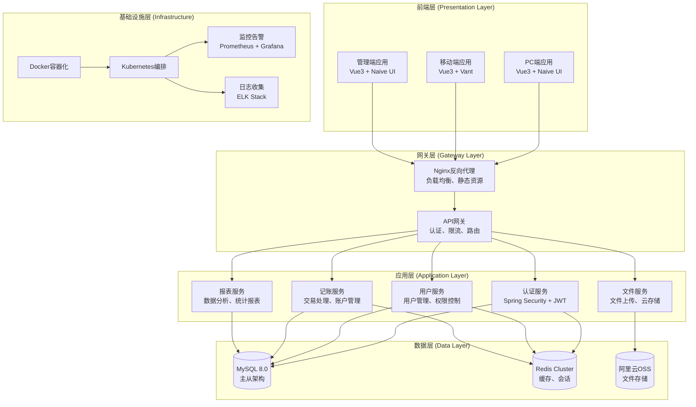
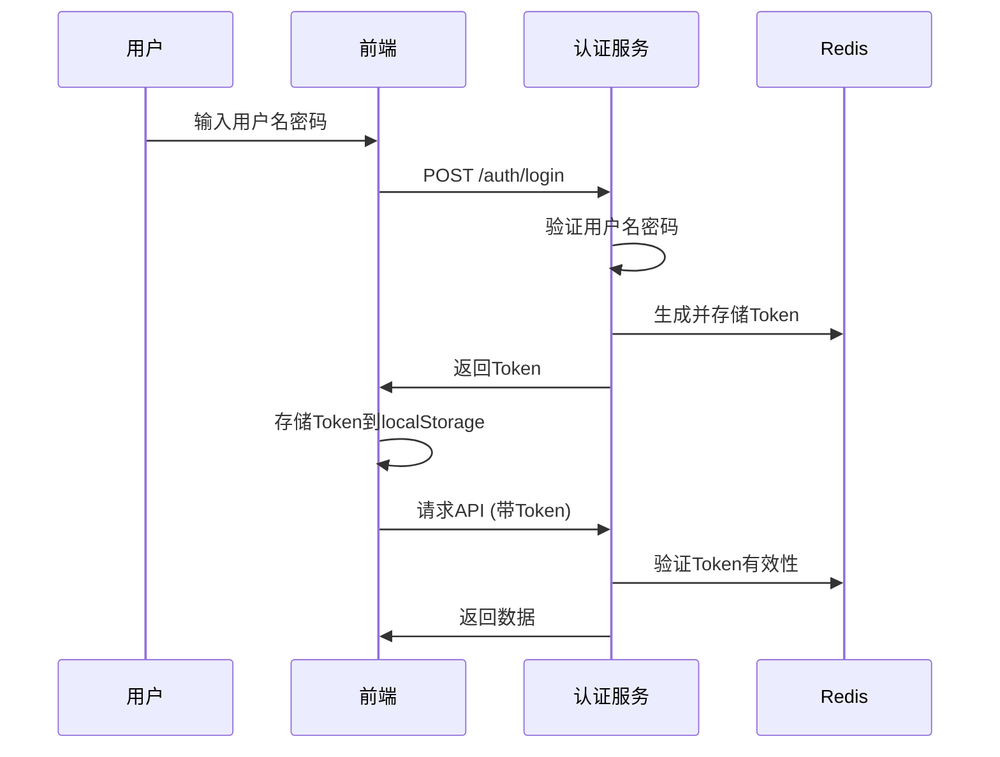
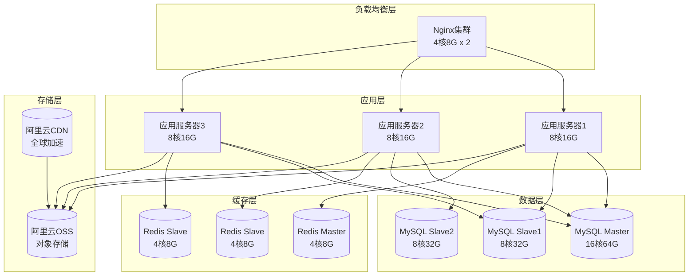

# G-Zang (归藏) 技术架构设计规范

## 1. 总体架构

### 1.1 系统架构总览



### 1.2 架构设计原则

#### 1.2.1 微服务设计原则
- **单一职责**：每个服务职责明确，功能内聚
- **服务自治**：服务独立部署、独立扩展、独立维护
- **轻量通信**：使用RESTful API或消息队列通信
- **容错设计**：服务降级、熔断、限流保护

#### 1.2.2 前端架构原则
- **组件化**：可复用组件库，标准化开发
- **微前端**：PC端采用qiankun架构，支持业务解耦
- **响应式设计**：适配不同屏幕尺寸和设备
- **性能优化**：懒加载、缓存策略、CDN加速

#### 1.2.3 数据架构原则
- **多租户隔离**：用户级和企业级数据隔离
- **读写分离**：数据库读写分离提升性能
- **数据分层**：冷热数据分离，优化存储成本
- **数据安全**：加密存储，访问控制，审计日志

### 1.3 技术栈选型

#### 1.3.1 前端技术栈
```json
{
  "框架": "Vue 3 (Composition API)",
  "构建工具": "Vite 4.x",
  "状态管理": "Pinia",
  "路由": "Vue Router 4",
  "UI组件库": {
    "PC端": "Naive UI",
    "移动端": "Vant 4.x"
  },
  "HTTP客户端": "Axios",
  "类型定义": "TypeScript 5.x",
  "代码规范": "ESLint + Prettier",
  "微前端": "qiankun 3.x",
  "测试框架": "Jest + Vue Test Utils"
}
```

#### 1.3.2 后端技术栈
```json
{
  "语言": "Java 17",
  "框架": "Spring Boot 3.1.x",
  "ORM": "MyBatis Plus 3.5.x",
  "安全框架": "Spring Security 6.x",
  "数据库": "MySQL 8.0",
  "缓存": "Redis 7.x",
  "消息队列": "RabbitMQ (预留)",
  "API文档": "SpringDoc OpenAPI 2.x",
  "连接池": "Druid 1.2.x",
  "工具库": "Lombok, Apache Commons, Guava",
  "测试框架": "JUnit 5 + Mockito"
}
```

#### 1.3.3 基础设施技术栈
```json
{
  "容器化": "Docker 24.x",
  "编排工具": "Docker Compose (开发/测试)",
  "生产编排": "Kubernetes 1.28.x (预留)",
  "CI/CD": "GitHub Actions",
  "代码质量": "SonarQube",
  "监控": "Prometheus + Grafana",
  "日志": "ELK Stack",
  "负载均衡": "Nginx",
  "云服务": "阿里云 ECS/RDS/OSS/Redis"
}
```

---

## 2. 前端架构设计

### 2.1 应用结构设计

#### 2.1.1 Monorepo结构
```
G-Zang/
├── apps/                          # 应用目录
│   ├── admin/                     # 管理端
│   │   ├── src/
│   │   │   ├── views/            # 页面组件
│   │   │   ├── components/       # 业务组件
│   │   │   ├── composables/      # 组合式函数
│   │   │   ├── stores/           # 状态管理
│   │   │   ├── router/           # 路由配置
│   │   │   ├── api/              # API调用
│   │   │   └── utils/            # 工具函数
│   │   ├── public/
│   │   ├── index.html
│   │   ├── vite.config.ts
│   │   └── package.json
│   ├── pc-main/                   # PC主应用
│   ├── pc-personal/               # 个人记账子应用
│   ├── pc-business/               # 企业业务子应用
│   └── mobile/                    # 移动端应用
├── packages/                      # 共享包
│   └── shared/                    # 跨端共享模块
│       ├── src/
│       │   ├── api/              # API封装
│       │   ├── types/            # TypeScript类型
│       │   ├── utils/            # 通用工具
│       │   ├── constants/        # 常量定义
│       │   └── components/       # 共享组件
│       └── package.json
├── tools/                         # 构建工具
├── docs/                          # 项目文档
└── package.json                   # 根配置 (pnpm workspace)
```

#### 2.1.2 组件设计规范
- **组件命名**：PascalCase (UserList.vue)
- **文件命名**：kebab-case (user-list.vue)
- **组件结构**：
```vue
<template>
  <!-- 模板内容 -->
</template>

<script setup lang="ts">
  // 组合式API
  // 类型定义
  // 响应式数据
  // 计算属性
  // 方法定义
</script>

<style scoped>
  /* 组件样式 */
</style>
```

### 2.2 状态管理设计

#### 2.2.1 Pinia Store设计
```typescript
// stores/useAuthStore.ts
import { defineStore } from 'pinia'
import { ref, computed } from 'vue'

export const useAuthStore = defineStore('auth', () => {
  // 状态
  const user = ref<User | null>(null)
  const token = ref<string>('')

  // 计算属性
  const isLoggedIn = computed(() => !!token.value)
  const userRole = computed(() => user.value?.role || '')

  // 动作
  const login = async (credentials: LoginParams) => {
    // 登录逻辑
  }

  const logout = () => {
    // 登出逻辑
  }

  return {
    user,
    token,
    isLoggedIn,
    userRole,
    login,
    logout
  }
})
```

#### 2.2.2 Store组织结构
```
stores/
├── modules/                       # 按模块组织
│   ├── auth.ts                   # 认证状态
│   ├── user.ts                   # 用户信息
│   ├── accounting.ts             # 记账业务
│   └── company.ts                # 企业信息
├── plugins/                      # Store插件
│   ├── persist.ts                # 持久化插件
│   └── logger.ts                 # 日志插件
└── index.ts                      # 导出配置
```

### 2.3 API设计规范

#### 2.3.1 API封装结构
```typescript
// packages/shared/src/api/index.ts
import axios, { AxiosInstance, AxiosRequestConfig } from 'axios'
import { ElMessage } from 'naive-ui'

// 创建axios实例
const apiClient: AxiosInstance = axios.create({
  baseURL: import.meta.env.VITE_API_BASE_URL,
  timeout: 10000,
  headers: {
    'Content-Type': 'application/json'
  }
})

// 请求拦截器
apiClient.interceptors.request.use(
  (config) => {
    const token = localStorage.getItem('token')
    if (token) {
      config.headers.Authorization = `Bearer ${token}`
    }
    return config
  },
  (error) => Promise.reject(error)
)

// 响应拦截器
apiClient.interceptors.response.use(
  (response) => response.data,
  (error) => {
    const { response } = error
    if (response?.status === 401) {
      // 处理未授权
      useAuthStore().logout()
    } else {
      ElMessage.error(response?.data?.message || '请求失败')
    }
    return Promise.reject(error)
  }
)

export default apiClient
```

#### 2.3.2 API模块组织
```typescript
// packages/shared/src/api/modules/user.ts
import apiClient from '../index'

export interface User {
  id: number
  username: string
  nickname: string
  roleId: number
  companyId?: number
}

export const userApi = {
  // 获取用户信息
  getInfo: () => apiClient.get<User>('/user/info'),

  // 更新用户信息
  updateProfile: (data: Partial<User>) =>
    apiClient.put('/user/profile', data),

  // 修改密码
  changePassword: (data: { oldPassword: string; newPassword: string }) =>
    apiClient.post('/user/change-password', data)
}

export default userApi
```

---

## 3. 后端架构设计

### 3.1 分层架构

#### 3.1.1 标准分层
```
Controller层 (API接口层)
    ↓ HTTP请求/响应处理
Service层 (业务逻辑层)
    ↓ 业务规则处理
Mapper层 (数据访问层)
    ↓ 数据库操作
Entity层 (数据模型层)
    ↓ 数据对象定义
```

#### 3.1.2 目录结构
```
src/main/java/com/gzang/app/
├── config/                       # 配置类
│   ├── SecurityConfig.java       # 安全配置
│   ├── MyBatisPlusConfig.java    # MyBatis配置
│   ├── JwtAuthenticationFilter.java # JWT过滤器
│   ├── TenantInterceptor.java    # 多租户拦截器
│   ├── SwaggerConfig.java        # API文档配置
│   └── WebConfig.java            # Web配置
├── controller/                   # 控制器层
│   ├── AuthController.java       # 认证接口
│   ├── UserController.java       # 用户接口
│   ├── AccountingController.java # 记账接口
│   └── ReportController.java     # 报表接口
├── service/                      # 业务逻辑层
│   ├── impl/                     # 实现类
│   └── interfaces/               # 接口定义
├── mapper/                       # 数据访问层
├── entity/                       # 实体类
│   ├── BaseEntity.java           # 基础实体
│   ├── User.java                 # 用户实体
│   ├── Transaction.java          # 交易实体
│   └── Company.java              # 企业实体
├── dto/                          # 数据传输对象
├── vo/                           # 视图对象
├── exception/                    # 异常处理
├── util/                         # 工具类
├── constant/                     # 常量定义
└── GZangApplication.java         # 启动类
```

### 3.2 核心组件设计

#### 3.2.1 统一响应对象
```java
// vo/Result.java
@Data
public class Result<T> {
    private Integer code;
    private String message;
    private T data;
    private Long timestamp;

    public static <T> Result<T> success(T data) {
        return Result.<T>builder()
            .code(0)
            .message("操作成功")
            .data(data)
            .timestamp(System.currentTimeMillis())
            .build();
    }

    public static <T> Result<T> error(String message) {
        return Result.<T>builder()
            .code(500)
            .message(message)
            .timestamp(System.currentTimeMillis())
            .build();
    }
}
```

#### 3.2.2 基础实体类
```java
// entity/BaseEntity.java
@Data
public class BaseEntity implements Serializable {
    @TableId(type = IdType.AUTO)
    private Long id;

    @TableField(fill = FieldFill.INSERT)
    private LocalDateTime createTime;

    @TableField(fill = FieldFill.INSERT_UPDATE)
    private LocalDateTime updateTime;
}
```

#### 3.2.3 业务异常类
```java
// exception/BusinessException.java
public class BusinessException extends RuntimeException {
    private Integer code;
    private String message;

    public BusinessException(String message) {
        super(message);
        this.code = 500;
        this.message = message;
    }

    public BusinessException(Integer code, String message) {
        super(message);
        this.code = code;
        this.message = message;
    }
}
```

### 3.3 多租户实现

#### 3.3.1 租户上下文
```java
// util/TenantContextHolder.java
public class TenantContextHolder {
    private static final ThreadLocal<TenantContext> CONTEXT = new ThreadLocal<>();

    public static void setTenantId(Long tenantId) {
        TenantContext context = CONTEXT.get();
        if (context == null) {
            context = new TenantContext();
            CONTEXT.set(context);
        }
        context.setTenantId(tenantId);
    }

    public static Long getTenantId() {
        TenantContext context = CONTEXT.get();
        return context != null ? context.getTenantId() : null;
    }

    public static void clear() {
        CONTEXT.remove();
    }
}
```

#### 3.3.2 MyBatis拦截器
```java
// config/TenantInterceptor.java
@Component
@Intercepts({
    @Signature(type = Executor.class, method = "query",
               args = {MappedStatement.class, Object.class, RowBounds.class, ResultHandler.class}),
    @Signature(type = Executor.class, method = "update",
               args = {MappedStatement.class, Object.class})
})
public class TenantInterceptor implements Interceptor {

    @Override
    public Object intercept(Invocation invocation) throws Throwable {
        // 获取当前租户ID
        Long tenantId = TenantContextHolder.getTenantId();

        if (tenantId != null) {
            // 动态添加租户条件
            MappedStatement mappedStatement = (MappedStatement) invocation.getArgs()[0];
            Object parameter = invocation.getArgs()[1];

            // 构建新的SQL
            String sql = buildTenantSql(mappedStatement.getBoundSql(parameter).getSql());
            BoundSql newBoundSql = new BoundSql(
                mappedStatement.getConfiguration(),
                sql,
                buildParameterMappings(parameter),
                parameter
            );

            // 替换BoundSql
            invocation.getArgs()[1] = parameter;
            // 设置新的BoundSql到MappedStatement (需要特殊处理)
        }

        return invocation.proceed();
    }

    private String buildTenantSql(String originalSql) {
        // 添加租户条件逻辑
        return originalSql + " AND tenant_id = #{tenantId}";
    }
}
```

---

## 4. 数据架构设计

### 4.1 数据库设计原则

#### 4.1.1 命名规范
- **表名**：t_ + 下划线命名 (t_user, t_transaction)
- **字段名**：小写下划线命名 (user_name, create_time)
- **索引名**：idx_ + 表名 + 字段名 (idx_user_username)
- **约束名**：fk_ + 表名 + 关联表名 (fk_user_role)

#### 4.1.2 设计原则
- **范式设计**：满足3NF，适当反范式提升查询性能
- **字段类型**：使用合适的数据类型，控制字段长度
- **索引策略**：主键索引、外键索引、复合索引、覆盖索引
- **分区策略**：按时间分区大表，提升查询性能

### 4.2 多租户数据隔离

#### 4.2.1 隔离策略
```sql
-- 用户级数据表
CREATE TABLE t_user (
    id BIGINT PRIMARY KEY AUTO_INCREMENT,
    username VARCHAR(64) NOT NULL COMMENT '用户名',
    -- 其他字段
    INDEX idx_username (username)
) COMMENT '用户表';

-- 企业级数据表
CREATE TABLE t_company (
    id BIGINT PRIMARY KEY AUTO_INCREMENT,
    company_name VARCHAR(128) NOT NULL COMMENT '公司名称',
    -- 其他字段
) COMMENT '公司表';

-- 多租户数据表 (支持用户和企业)
CREATE TABLE t_transaction (
    id BIGINT PRIMARY KEY AUTO_INCREMENT,
    user_id BIGINT COMMENT '用户ID (个人交易)',
    company_id BIGINT COMMENT '公司ID (企业交易)',
    amount DECIMAL(18,2) NOT NULL COMMENT '交易金额',
    -- 其他字段
    INDEX idx_user_time (user_id, transaction_time),
    INDEX idx_company_time (company_id, transaction_time)
) COMMENT '交易记录表';
```

#### 4.2.2 数据隔离验证
- **应用层隔离**：通过ThreadLocal存储租户上下文
- **数据库层隔离**：MyBatis拦截器自动添加租户条件
- **缓存层隔离**：Redis Key包含租户标识
- **文件存储隔离**：OSS目录按租户组织

### 4.3 性能优化策略

#### 4.3.1 索引优化
```sql
-- 复合索引优化查询
ALTER TABLE t_transaction
ADD INDEX idx_user_category_time (user_id, category_id, transaction_time);

-- 覆盖索引避免回表
ALTER TABLE t_transaction
ADD INDEX idx_user_amount (user_id, amount, transaction_time);

-- 分页查询优化
ALTER TABLE t_transaction
ADD INDEX idx_user_time_id (user_id, transaction_time, id);
```

#### 4.3.2 分表策略
```sql
-- 按月分表 (历史数据归档)
CREATE TABLE t_transaction_202401 (
    -- 字段定义
) PARTITION BY RANGE (YEAR(transaction_time)) (
    PARTITION p202401 VALUES LESS THAN (202402),
    PARTITION p202402 VALUES LESS THAN (202403)
);

-- 按用户分表 (超大用户)
-- 使用分库分表中间件 (如ShardingSphere)
```

#### 4.3.3 缓存策略
```java
@Configuration
public class CacheConfig {

    @Bean
    public RedisCacheManager cacheManager(RedisConnectionFactory connectionFactory) {
        RedisCacheConfiguration config = RedisCacheConfiguration.defaultCacheConfig()
            .entryTtl(Duration.ofHours(1))  // 默认1小时过期
            .serializeKeysWith(
                RedisSerializationContext.SerializationPair.fromSerializer(
                    new StringRedisSerializer()))
            .serializeValuesWith(
                RedisSerializationContext.SerializationPair.fromSerializer(
                    new Jackson2JsonRedisSerializer<>(Object.class)));

        return RedisCacheManager.builder(connectionFactory)
            .cacheDefaults(config)
            .build();
    }
}
```

---

## 5. 安全架构设计

### 5.1 身份认证与授权

#### 5.1.1 JWT认证流程


#### 5.1.2 权限控制模型
```java
// 基于角色的访问控制 (RBAC)
@Entity
public class Role {
    @Id
    private Long id;
    private String roleName;
    private String roleCode;

    @ManyToMany
    @JoinTable(name = "t_role_permission")
    private Set<Permission> permissions;
}

@Entity
public class Permission {
    @Id
    private Long id;
    private String permissionName;
    private String permissionCode;
    private String resource;
    private String action; // CREATE, READ, UPDATE, DELETE
}
```

### 5.2 数据安全

#### 5.2.1 数据加密
```java
@Configuration
public class EncryptionConfig {

    @Bean
    public Cipherer cipherer() {
        return new AESCipherer("your-secret-key"); // 32位密钥
    }
}

// 敏感数据加密存储
@Entity
public class User {
    // 其他字段...

    @Convert(converter = EncryptedStringConverter.class)
    private String password; // 密码加密

    @Convert(converter = EncryptedStringConverter.class)
    private String phone; // 手机号加密
}
```

#### 5.2.2 数据脱敏
```java
public class DataMaskingUtil {

    // 手机号脱敏
    public static String maskPhone(String phone) {
        if (StringUtils.isBlank(phone) || phone.length() != 11) {
            return phone;
        }
        return phone.substring(0, 3) + "****" + phone.substring(7);
    }

    // 银行卡号脱敏
    public static String maskBankCard(String cardNo) {
        if (StringUtils.isBlank(cardNo) || cardNo.length() < 8) {
            return cardNo;
        }
        return cardNo.substring(0, 4) + " **** **** " + cardNo.substring(cardNo.length() - 4);
    }
}
```

### 5.3 安全防护

#### 5.3.1 API安全
```java
@Configuration
public class SecurityConfig {

    @Bean
    public SecurityFilterChain filterChain(HttpSecurity http) throws Exception {
        http
            .csrf().disable()
            .cors().and()
            .headers(headers -> headers
                .frameOptions().deny()
                .contentTypeOptions().and()
                .httpStrictTransportSecurity(hstsConfig -> hstsConfig
                    .maxAgeInSeconds(31536000)
                    .includeSubdomains(true)))
            .authorizeHttpRequests(authz -> authz
                .requestMatchers("/api/v1/auth/**").permitAll()
                .requestMatchers("/actuator/**").hasRole("ADMIN")
                .anyRequest().authenticated())
            .addFilterBefore(jwtAuthenticationFilter(), UsernamePasswordAuthenticationFilter.class)
            .sessionManagement().sessionCreationPolicy(SessionCreationPolicy.STATELESS);

        return http.build();
    }
}
```

#### 5.3.2 请求限流
```java
@Configuration
public class RateLimitConfig {

    @Bean
    public KeyResolver userKeyResolver() {
        return exchange -> {
            String token = exchange.getRequest().getHeaders().getFirst("Authorization");
            if (StringUtils.hasText(token) && token.startsWith("Bearer ")) {
                // 解析JWT获取用户ID
                return Mono.just(getUserIdFromToken(token.substring(7)));
            }
            return Mono.just(exchange.getRequest().getRemoteAddress().getAddress().getHostAddress());
        };
    }
}
```

---

## 6. 性能优化设计

### 6.1 前端性能优化

#### 6.1.1 打包优化
```javascript
// vite.config.js
export default {
  build: {
    rollupOptions: {
      output: {
        manualChunks: {
          vendor: ['vue', 'vue-router', 'pinia'],
          ui: ['naive-ui'],
          chart: ['echarts'],
          utils: ['axios', 'dayjs', 'lodash-es']
        }
      }
    },
    chunkSizeWarningLimit: 1000,
    minify: 'terser',
    terserOptions: {
      compress: {
        drop_console: true,
        drop_debugger: true
      }
    }
  }
}
```

#### 6.1.2 运行时优化
```typescript
// 路由懒加载
const routes = [
  {
    path: '/accounting',
    component: () => import('@/views/accounting/index.vue'),
    children: [
      {
        path: 'quick',
        component: () => import('@/views/accounting/quick-entry.vue')
      }
    ]
  }
]

// 组件懒加载
const AsyncComponent = defineAsyncComponent({
  loader: () => import('@/components/HeavyComponent.vue'),
  loadingComponent: LoadingComponent,
  errorComponent: ErrorComponent,
  delay: 200,
  timeout: 3000
})
```

### 6.2 后端性能优化

#### 6.2.1 缓存策略
```java
@Service
public class AccountingServiceImpl implements AccountingService {

    @Autowired
    private RedisTemplate<String, Object> redisTemplate;

    @Override
    @Cacheable(value = "transaction", key = "#userId + '_' + #page + '_' + #size")
    public Page<TransactionVO> getTransactionPage(Long userId, int page, int size) {
        // 查询逻辑
        return transactionMapper.selectPage(page, size, userId);
    }

    @Override
    @CacheEvict(value = "transaction", key = "#transaction.userId + '_*'")
    public void createTransaction(Transaction transaction) {
        // 创建逻辑
        transactionMapper.insert(transaction);
    }
}
```

#### 6.2.2 数据库优化
```java
@Configuration
public class MyBatisPlusConfig {

    @Bean
    public MybatisPlusInterceptor mybatisPlusInterceptor() {
        MybatisPlusInterceptor interceptor = new MybatisPlusInterceptor();

        // 分页插件
        interceptor.addInnerInterceptor(new PaginationInnerInterceptor(DbType.MYSQL));

        // 乐观锁插件
        interceptor.addInnerInterceptor(new OptimisticLockerInnerInterceptor());

        // 防止全表更新删除
        interceptor.addInnerInterceptor(new BlockAttackInnerInterceptor());

        return interceptor;
    }
}
```

#### 6.2.3 异步处理
```java
@Service
public class ReportServiceImpl implements ReportService {

    @Autowired
    private AsyncTaskExecutor taskExecutor;

    @Override
    public CompletableFuture<ReportVO> generateMonthlyReport(Long userId, String month) {
        return CompletableFuture.supplyAsync(() -> {
            // 复杂的报表生成逻辑
            return buildMonthlyReport(userId, month);
        }, taskExecutor);
    }
}
```

### 6.3 系统性能监控

#### 6.3.1 指标收集
```yaml
# application-prod.yml
management:
  endpoints:
    web:
      exposure:
        include: health,info,metrics,prometheus
  metrics:
    export:
      prometheus:
        enabled: true
    distribution:
      percentiles-histogram:
        http.server.requests: true
  monitoring:
    export:
      prometheus:
        pushgateway:
          enabled: false
```

#### 6.3.2 性能告警
```yaml
# prometheus规则
groups:
  - name: gzang_performance
    rules:
      # 响应时间告警
      - alert: HighResponseTime
        expr: histogram_quantile(0.95, rate(http_server_requests_duration_seconds_bucket[5m])) > 2
        for: 5m
        labels:
          severity: warning
        annotations:
          summary: "API响应时间过高: {{ $value }}s"

      # 错误率告警
      - alert: HighErrorRate
        expr: rate(http_server_requests_total{status=~"5.."}[5m]) / rate(http_server_requests_total[5m]) > 0.05
        for: 5m
        labels:
          severity: error
        annotations:
          summary: "API错误率过高: {{ $value }}"
```

---

## 7. 部署架构设计

### 7.1 容器化部署

#### 7.1.1 Dockerfile设计
```dockerfile
# 多阶段构建 - 后端
FROM maven:3.9.4-openjdk-17-slim AS builder
WORKDIR /app
COPY pom.xml .
RUN mvn dependency:go-offline
COPY src ./src
RUN mvn package -DskipTests

FROM openjdk:17-jre-slim
WORKDIR /app
COPY --from=builder /app/target/*.jar app.jar
EXPOSE 8080
ENTRYPOINT ["java", "-jar", "app.jar", "--spring.profiles.active=prod"]
```

#### 7.1.2 Docker Compose配置
```yaml
version: '3.8'
services:
  mysql:
    image: mysql:8.0
    environment:
      MYSQL_ROOT_PASSWORD: ${MYSQL_ROOT_PASSWORD}
      MYSQL_DATABASE: gzang
      MYSQL_USER: gzang
      MYSQL_PASSWORD: ${MYSQL_PASSWORD}
    volumes:
      - mysql_data:/var/lib/mysql
      - ./db/init.sql:/docker-entrypoint-initdb.d/init.sql
    ports:
      - "3306:3306"
    networks:
      - gzang-network

  redis:
    image: redis:7-alpine
    volumes:
      - redis_data:/data
    ports:
      - "6379:6379"
    networks:
      - gzang-network

  app:
    build: .
    ports:
      - "8080:8080"
    depends_on:
      - mysql
      - redis
    environment:
      SPRING_PROFILES_ACTIVE: prod
      SPRING_DATASOURCE_URL: jdbc:mysql://mysql:3306/gzang
      SPRING_REDIS_HOST: redis
    networks:
      - gzang-network

volumes:
  mysql_data:
  redis_data:

networks:
  gzang_network:
    driver: bridge
```

### 7.2 生产环境架构

#### 7.2.1 高可用架构


#### 7.2.2 备份策略
- **数据库备份**：每日全量备份，每小时增量备份
- **应用备份**：容器镜像备份，配置文件备份
- **文件备份**：OSS跨区域复制，定期清理过期文件
- **备份验证**：定期进行备份恢复演练

### 7.3 CI/CD流水线

#### 7.3.1 GitHub Actions配置
```yaml
# .github/workflows/deploy.yml
name: Deploy to Production

on:
  push:
    branches: [ main ]
    paths: [ 'server/**' ]

jobs:
  build-and-deploy:
    runs-on: ubuntu-latest
    environment: production

    steps:
      - name: Checkout code
        uses: actions/checkout@v4

      - name: Set up JDK 17
        uses: actions/setup-java@v4
        with:
          java-version: '17'
          distribution: 'temurin'

      - name: Build with Maven
        run: mvn clean package -DskipTests

      - name: Build Docker image
        run: |
          docker build -t gzang/app:${{ github.sha }} ./server
          docker tag gzang/app:${{ github.sha }} gzang/app:latest

      - name: Push to registry
        run: |
          echo ${{ secrets.DOCKER_PASSWORD }} | docker login -u ${{ secrets.DOCKER_USERNAME }} --password-stdin
          docker push gzang/app:${{ github.sha }}
          docker push gzang/app:latest

      - name: Deploy to production
        run: |
          # 触发生产环境更新 (通过API调用或SSH)
          curl -X POST ${{ secrets.DEPLOY_WEBHOOK }} \
            -H "Authorization: Bearer ${{ secrets.DEPLOY_TOKEN }}" \
            -d '{"image": "gzang/app:${{ github.sha }}"}'
```

---

## 8. 监控和运维

### 8.1 应用监控

#### 8.1.1 指标收集
```java
@Configuration
public class MonitoringConfig {

    @Bean
    public MeterRegistryCustomizer<MeterRegistry> metricsCommonTags() {
        return registry -> registry.config()
            .commonTags("application", "gzang-backend")
            .commonTags("version", "1.0.0");
    }

    @Bean
    public TimedAspect timedAspect(MeterRegistry registry) {
        return new TimedAspect(registry);
    }
}

// 使用监控注解
@Service
public class AccountingServiceImpl implements AccountingService {

    @Timed(value = "accounting.transaction.create", description = "创建交易耗时")
    public void createTransaction(Transaction transaction) {
        // 业务逻辑
    }

    @Counted(value = "accounting.transaction.query", description = "查询交易次数")
    public List<Transaction> queryTransactions(Long userId) {
        // 业务逻辑
    }
}
```

#### 8.1.2 健康检查
```java
@Component
public class DatabaseHealthIndicator implements HealthIndicator {

    @Autowired
    private DataSource dataSource;

    @Override
    public Health health() {
        try (Connection connection = dataSource.getConnection()) {
            // 执行简单查询检查数据库连接
            PreparedStatement ps = connection.prepareStatement("SELECT 1");
            ResultSet rs = ps.executeQuery();
            rs.close();
            ps.close();

            return Health.up().build();
        } catch (Exception e) {
            return Health.down()
                .withDetail("error", e.getMessage())
                .build();
        }
    }
}
```

### 8.2 日志管理

#### 8.2.1 日志配置
```xml
<!-- logback-spring.xml -->
<configuration>
    <!-- 控制台输出 -->
    <appender name="CONSOLE" class="ch.qos.logback.core.ConsoleAppender">
        <encoder>
            <pattern>%d{yyyy-MM-dd HH:mm:ss.SSS} [%thread] %-5level %logger{36} - %msg%n</pattern>
        </encoder>
    </appender>

    <!-- 文件输出 -->
    <appender name="FILE" class="ch.qos.logback.core.rolling.RollingFileAppender">
        <file>logs/gzang.log</file>
        <rollingPolicy class="ch.qos.logback.core.rolling.TimeBasedRollingPolicy">
            <fileNamePattern>logs/gzang.%d{yyyy-MM-dd}.%i.log</fileNamePattern>
            <maxFileSize>100MB</maxFileSize>
            <maxHistory>30</maxHistory>
            <totalSizeCap>3GB</totalSizeCap>
        </rollingPolicy>
        <encoder>
            <pattern>%d{yyyy-MM-dd HH:mm:ss.SSS} [%thread] %-5level %logger{36} - %msg%n</pattern>
        </encoder>
    </appender>

    <!-- 异步输出 -->
    <appender name="ASYNC" class="ch.qos.logback.classic.AsyncAppender">
        <appender-ref ref="FILE" />
        <queueSize>512</queueSize>
    </appender>

    <!-- 日志级别配置 -->
    <logger name="com.gzang" level="INFO" additivity="false">
        <appender-ref ref="CONSOLE" />
        <appender-ref ref="ASYNC" />
    </logger>

    <root level="INFO">
        <appender-ref ref="CONSOLE" />
        <appender-ref ref="ASYNC" />
    </root>
</configuration>
```

### 8.3 告警系统

#### 8.3.1 AlertManager配置
```yaml
# alertmanager.yml
global:
  smtp_smtp:
    host: 'smtp.gzang.com'
    port: 587
    username: 'alert@gzang.com'
    password: '${SMTP_PASSWORD}'

route:
  group_by: ['alertname', 'service']
  group_wait: 30s
  group_interval: 5m
  repeat_interval: 1h
  receiver: 'gzang-alerts'

receivers:
  - name: 'gzang-alerts'
    email_configs:
      - to: 'ops@gzang.com'
        subject: '[告警] {{ .GroupLabels.alertname }}'
        body: |
          {{ range .Alerts }}
          级别: {{ .Labels.severity }}
          摘要: {{ .Annotations.summary }}
          详情: {{ .Annotations.description }}
          时间: {{ .StartsAt.Format "2006-01-02 15:04:05" }}
          {{ end }}
```

---

## 9. 扩展性设计

### 9.1 微服务拆分策略

#### 9.1.1 服务边界定义
```
原有单体服务
├── 用户服务 (User Service)
├── 认证服务 (Auth Service)
├── 记账服务 (Accounting Service)
├── 报表服务 (Report Service)
└── 文件服务 (File Service)

可扩展为微服务
├── 用户微服务 (User Microservice)
│   ├── 用户管理
│   ├── 权限管理
│   └── 组织架构
├── 财务微服务 (Finance Microservice)
│   ├── 交易管理
│   ├── 账户管理
│   └── 分类管理
├── 分析微服务 (Analytics Microservice)
│   ├── 报表生成
│   ├── 数据分析
│   └── 图表展示
├── 通知微服务 (Notification Microservice)
│   ├── 邮件通知
│   ├── 短信通知
│   └── 推送通知
└── 网关服务 (API Gateway)
    ├── 路由转发
    ├── 负载均衡
    └── 安全控制
```

#### 9.1.2 服务通信设计
```java
// Feign客户端定义
@FeignClient(name = "user-service", fallback = UserServiceFallback.class)
public interface UserServiceClient {

    @GetMapping("/users/{id}")
    Result<UserVO> getUser(@PathVariable("id") Long userId);

    @PostMapping("/users")
    Result<UserVO> createUser(@RequestBody CreateUserDTO userDTO);
}

// 服务间异步通信
@Service
public class EventPublisher {

    @Autowired
    private StreamBridge streamBridge;

    public void publishTransactionCreated(Transaction transaction) {
        Message<TransactionCreatedEvent> message = MessageBuilder
            .withPayload(new TransactionCreatedEvent(transaction.getId()))
            .setHeader("eventType", "TRANSACTION_CREATED")
            .build();

        streamBridge.send("transaction-events", message);
    }
}
```

### 9.2 数据扩展策略

#### 9.2.1 分库分表设计
```java
@Configuration
public class ShardingConfig {

    @Bean
    public DataSource dataSource() {
        // 配置分库分表规则
        ShardingRuleConfiguration shardingRuleConfig = new ShardingRuleConfiguration();

        // 交易表分表规则 (按用户ID分表)
        ShardingTableRuleConfiguration transactionRule = new ShardingTableRuleConfiguration(
            "t_transaction", "ds_${0..3}.t_transaction_${0..15}");

        transactionRule.setTableShardingStrategy(new StandardShardingStrategyConfiguration(
            "user_id", new TransactionTableShardingAlgorithm()));

        shardingRuleConfig.getTables().add(transactionRule);

        // 创建数据源
        return ShardingDataSourceFactory.createDataSource(
            createDataSourceMap(), shardingRuleConfig, new Properties());
    }
}
```

#### 9.2.2 缓存扩展设计
```java
@Configuration
public class CacheConfig {

    @Bean
    public RedisConnectionFactory redisConnectionFactory() {
        // Redis集群配置
        RedisClusterConfiguration clusterConfig = new RedisClusterConfiguration()
            .clusterNode("redis-node1", 6379)
            .clusterNode("redis-node2", 6379)
            .clusterNode("redis-node3", 6379);

        return new JedisConnectionFactory(clusterConfig);
    }

    @Bean
    public CacheManager cacheManager(RedisConnectionFactory connectionFactory) {
        // 多级缓存配置
        CaffeineCacheManager caffeineCacheManager = new CaffeineCacheManager();
        caffeineCacheManager.setCaffeine(Caffeine.newBuilder()
            .initialCapacity(100)
            .maximumSize(1000)
            .expireAfterWrite(10, TimeUnit.MINUTES));

        RedisCacheManager redisCacheManager = RedisCacheManager.builder(connectionFactory)
            .cacheDefaults(RedisCacheConfiguration.defaultCacheConfig()
                .entryTtl(Duration.ofHours(1)))
            .build();

        // 返回组合缓存管理器
        return new CompositeCacheManager(caffeineCacheManager, redisCacheManager);
    }
}
```

---

**文档版本**：1.0.0
**最后更新**：2026-01-14
**维护人员**：技术架构师
